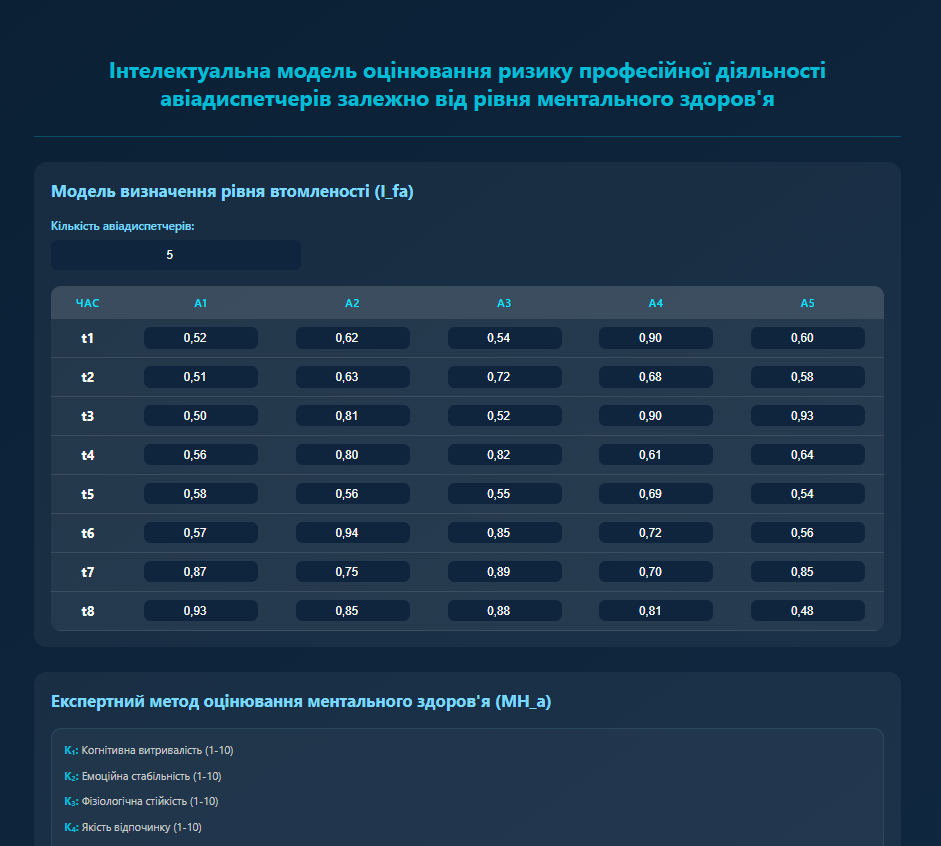

## ✈️ Інтелектуальна Модель Оцінювання Ризику Професійної Діяльності Авіадиспетчерів

Це веб-додаток, розроблений для оцінки рівня професійного ризику авіадиспетчерів. Модель використовує **нечітку логіку (Fuzzy Logic)**, поєднуючи оцінку **середньої втомленості** та **ментального здоров'я** для визначення кількісного та лінгвістичного рівня ризику.

### 📜 Структура Проекту

Проект складається з трьох класичних файлів для веб-розробки:

| Файл             | Опис                                                                                                                            |
| :--------------- | :------------------------------------------------------------------------------------------------------------------------------ |
| **`index.html`** | Основна HTML-структура програми: форми вводу, таблиці, кнопки та секція результатів.                                            |
| **`style.css`**  | Усі стилі (CSS) для забезпечення візуального оформлення та адаптивності інтерфейсу.                                             |
| **`script.js`**  | Уся логіка програми: функції генерації таблиць, розрахунок втомленості, фазифікація, модель ризику та відображення результатів. |

### 🛠️ Використані Технології

- **HTML5**
- **CSS3**
- **JavaScript** (чистий, без зовнішніх бібліотек)
  - Використовує математичні моделі **Нечіткої Логіки** (Z-сплайн, S-подібні функції належності).

### 📊 Принцип Роботи

Система працює за наступною логікою (детальний алгоритм знаходиться в `script.js`):

1.  **Ввід:** Користувач вводить кількість диспетчерів, дані про їх **втомленість** за 8 часових точок (vᵢ,ₜ) та бали за **8 критеріями ментального здоров'я** (Kᵢ,ₖ).
2.  **Розрахунок Втомленості:** Обчислюється середня втомленість $\text{fa}(a_i)$.
3.  **Фазифікація M/H:** Сума балів $\text{l}(a_i)$ ментального здоров'я перетворюється на нечітку оцінку $\lambda_{\text{MH}}(a_i)$ за допомогою **Z-сплайн функції**.
4.  **Агрегація Ризику:** На основі $\text{fa}(a_i)$ та лінгвістичного рівня $\lambda_{\text{MH}}(a_i)$ (L₁-L₅) обчислюється кількісна оцінка ризику $\text{r}(a_i)$ за допомогою однієї з **S-функцій належності**.
5.  **Вивід:** Відображається фінальний **Лінгвістичний Рівень Ризику** (R₁ - Низький до R₅ - Критичний) та графічна інтерпретація.
